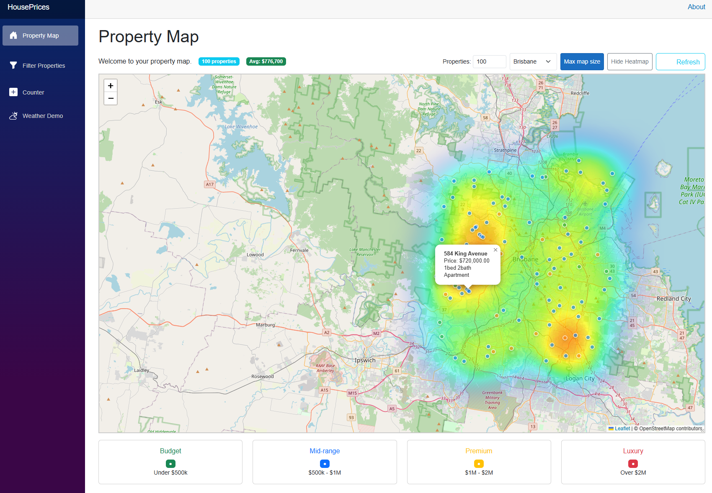

# House Prices Property Map

A Blazor Server application that visualizes property prices across Australian cities using an interactive map with heatmap functionality.



## Features

- **Interactive Property Map**: View properties across major Australian cities (Sydney, Melbourne, Brisbane, Perth, Adelaide)
- **Dynamic Heatmap Visualization**: Toggle a color-coded heatmap showing property price distributions
  - Blue zones: Lower-priced properties
  - Green/Yellow zones: Mid-range properties
  - Red zones: High-priced properties
- **Customizable Property Count**: Adjust the number of properties displayed (10-1000)
- **Price-Based Markers**: Color-coded property markers based on price categories
  - Green: Budget (< $500k)
  - Blue: Mid-range ($500k - $1M)
  - Orange: Premium ($1M - $2M)
  - Red: Luxury (> $2M)
- **Responsive Map Container**: Resizable map with maximize functionality
- **Real-time Statistics**: View average prices and total property count

## Technology Stack

- **Backend**: ASP.NET Core 9.0 with Blazor Server
- **Frontend**: Blazor Components with Bootstrap 5
- **Mapping**: Leaflet.js with OpenStreetMap
- **Heatmap**: Leaflet.heat plugin
- **Language**: C# (.NET 9.0)

## Prerequisites

- .NET 9.0 SDK or later
- Visual Studio 2022 or Visual Studio Code
- Modern web browser with JavaScript enabled

## Installation

1. Clone the repository:
```bash
git clone https://github.com/yourusername/house-prices-map.git
cd house-prices-map
```

2. Restore NuGet packages:
```bash
dotnet restore
```

3. Build the project:
```bash
dotnet build
```

4. Run the application:
```bash
dotnet run --project HousePrices
```

5. Navigate to `https://localhost:7248` or `http://localhost:5106` in your browser

## Project Structure

```
HousePrices/
├── Components/
│   ├── Layout/          # Layout components (MainLayout, NavMenu)
│   ├── Pages/           # Page components (Home, Filter, Weather, etc.)
│   ├── App.razor        # Root component
│   └── _Imports.razor   # Global imports
├── Models/
│   ├── Property.cs      # Property data model
│   ├── PropertyMarker.cs
│   ├── PropertyHeatmapPoint.cs
│   ├── MapLayerData.cs
│   └── PropertySearchCriteria.cs
├── Services/
│   ├── Interfaces/      # Service interfaces
│   ├── MockPropertyDataService.cs  # Mock data implementation
│   └── PropertyDataService.cs      # Future real implementation
├── wwwroot/
│   ├── css/            # Custom CSS files
│   ├── js/             # JavaScript files
│   │   └── property_map.js  # Map functionality
│   └── app.css         # Global styles
└── Program.cs          # Application entry point
```

## Usage

### Basic Navigation

1. **Property Map** (Home): View all properties with optional heatmap overlay
2. **Filter Properties**: Filter properties by various criteria (coming soon)

### Map Controls

- **Region Selection**: Choose from Sydney, Melbourne, Brisbane, Perth, or Adelaide
- **Property Count**: Enter a number between 10-1000 to adjust displayed properties
- **Max Map Size**: Expand the map to fill available width
- **Show/Hide Heatmap**: Toggle the price heatmap overlay
- **Refresh**: Reload property data

### Map Interaction

- **Zoom**: Use mouse wheel or zoom controls
- **Pan**: Click and drag to move around the map
- **Property Details**: Click on markers to view property information

### Implementing Real Data

Replace `MockPropertyDataService` with `PropertyDataService` and implement:
- API integration
- Database connections
- Real property data sources

## Configuration

The application uses standard ASP.NET Core configuration through `appsettings.json`:
- Logging levels
- Connection strings (when implemented)
- API endpoints (when implemented)

## Known Issues

- Property data is currently mocked (not real data)
- Filter page is not yet implemented
- Search functionality pending
- No authentication/authorization implemented
- Heatmap colouring is strange

## Contributing

1. Fork the repository
2. Create a feature branch (`git checkout -b feature/AmazingFeature`)
3. Commit your changes (`git commit -m 'Add some AmazingFeature'`)
4. Push to the branch (`git push origin feature/AmazingFeature`)
5. Open a Pull Request
